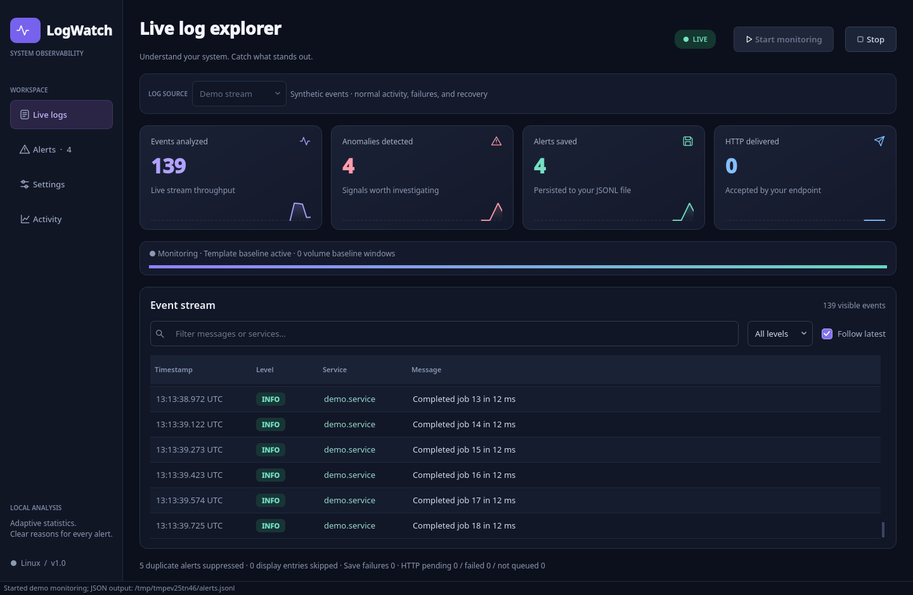
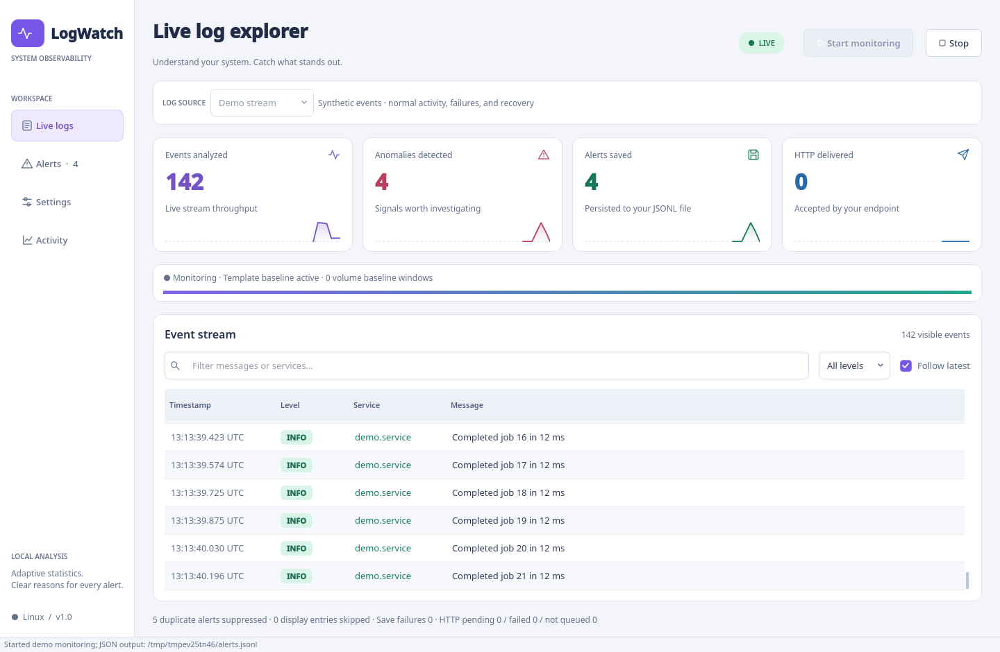

# LogWatch

A Python / PyQt6 GUI for Linux that follows logs in real time, detects unusual behavior, and produces structured JSON alerts. No model download, external AI service, or training dataset is required.

The interface features sidebar navigation, light and dark violet themes, live metric cards with real throughput charts, severity badges, searchable event history, and syntax-highlighted JSON with a **Copy JSON** action. Chart samples show counter increases per second during the current session. Timestamps are compact in the event table; hover to see their full original values. Settings scroll when space is limited.



## Run

From this directory, in a Linux desktop session with Python 3.10 or later:

```bash
python3 -m venv .venv
source .venv/bin/activate
python3 -m pip install -r requirements.txt
python3 -m logwatch --demo
```

For real logs, run `python3 -m logwatch` and select a source. Alternatively, install with `python3 -m pip install .` and launch `logwatch`.

1. In **Settings**, choose the JSONL output file, minimum score, and optional HTTP endpoint. The default output is `~/.local/state/logwatch/alerts.jsonl`. A bearer token is optional and stays in memory.
2. Choose **Systemd journal**, **Log file**, or **Demo stream**, then click **Start monitoring**.
3. Use the sidebar to open **Live logs**, filter by text or level, and inspect structured payloads in **Alerts**. **Activity** reports source and delivery failures.
4. Click **Stop** before changing detector or output settings. Appearance remains editable during monitoring. A new monitoring session starts a new baseline. Stopping or closing cancels HTTP work still pending; locally saved alerts remain available.

## Appearance and desktop integration

Open **Settings → Appearance → Color theme** and select **Follow system** (the default), **Light**, or **Dark**. Changes apply immediately to tables, badges, charts, controls, and JSON highlighting without restarting monitoring or resetting the detector. The appearance preference is saved using Qt's user configuration storage and restored on the next launch.

**Follow system** listens to [Qt's color-scheme notifications](https://doc.qt.io/qt-6.10/qstylehints.html#colorScheme-prop) and the [XDG Desktop Portal appearance setting](https://flatpak.github.io/xdg-desktop-portal/docs/doc-org.freedesktop.portal.Settings.html). On desktops exposing the portal, its explicit light/dark preference takes priority; otherwise Qt's native scheme is used. If neither reports a scheme, the app uses the system palette's light/dark brightness. Portal reads are asynchronous, and desktop changes are observed while the app is open. Selecting Light or Dark overrides the desktop preference only for LogWatch. The app reads desktop settings and never modifies the global theme.

On GNOME, KDE, or another Linux desktop, change the appearance in your desktop's settings with LogWatch set to **Follow system**. Automatic updates require a working Qt platform-theme integration or XDG Settings portal/backend that reports appearance changes. Minimal window managers and headless sessions may provide neither; use the manual options there. The implementation's desktop notifications and override behavior are tested with simulated Qt/portal events; live GNOME/KDE switching is not verified in the headless development environment.



The demo uses synthetic logs and requires no journal permissions. It starts with 120 normal records, followed by resource and authentication failures, new templates, and recovery. It uses the same detector and output pipeline as real monitoring.

## Why statistics rather than a pretrained NLP model?

Linux logs contain machine-specific services, identifiers, addresses, and message formats. With no labeled examples from the target machine, a general pretrained text model has no calibrated definition of abnormal behavior. This implementation therefore uses a small, explainable detector that learns the current stream and runs on the CPU with bounded memory. A trained model could be added later after collecting representative normal logs and evaluating false positives on held-out incidents.

The detector combines:

| Signal | Default behavior | Score |
|---|---|---:|
| Known kernel failures | Kernel panic, segfault, kernel `BUG:` | 98 |
| Resource exhaustion | OOM, disk full, no space left | 95 |
| Storage failures | I/O error, filesystem corruption, read-only filesystem | 92 |
| Critical / error severity | Journald priority, JSON severity, or error words in plain logs | 90 / 60 |
| Authentication failures | Failed password, invalid user, authentication failure, permission denied | 70 |
| Novel message template | New service + normalized message after 100 warmup records | 65 |
| Log volume spike | Fixed 10-second count compared with previous windows | 85 |
| Error-rate spike | Error/critical fraction compared with previous sufficiently populated windows | 85 |

Numbers, IPv4 addresses, hexadecimal values, and UUIDs are normalized so changing job IDs or addresses do not create new templates. Up to 4,096 templates are kept with least-recently-used eviction. A template absent from that current baseline is considered novel, even if it was observed in an older session or evicted earlier.

Rate checks use the previous 60 windows and require at least six baseline observations. For volume, the threshold is the largest of 20 events, 3 × the median, and median + 6 × max(1, 1.4826 × MAD). MAD is the median absolute deviation. Empty windows count toward the volume baseline. Error-rate learning uses only windows containing at least 10 events; detection also requires at least 5 errors. Its threshold is min(1, max(0.30, median + 6 × max(0.03, 1.4826 × MAD))). Detection compares the completed window before adding it to the baseline.

Scores are heuristic severity values, **not probabilities**. The highest applicable score wins; all relevant reasons are included. By default, score ≥60 produces an alert. Scores ≥90 are critical, ≥75 high, and other emitted alerts medium. Repeated alerts for the same normalized template are suppressed for 60 seconds, except when severity increases. Window spike reasons have their own cooldown. Known failures operate during warmup.

## Sources and behavior

- **Journal:** launches `journalctl --follow --lines=0 --output=json --no-pager --all` without a shell. Optional unit and user-journal filters are supported. Journal timestamps, service identifiers, and priorities are preserved. The current account needs permission to read the selected journal; the application never requests elevated privileges.
- **File:** reads newly appended newline-delimited records by default. Enable **Read existing lines** to replay the file. Follows rename/create rotation and copy-truncate, including detected regrowth between polls. Missing paths during rotation are retried, and a non-regular replacement (FIFO, device) is never opened. Requires read access to an existing regular file.
- **Formats:** journald JSON, simple JSON with `message`/`msg`, `service`, `level`/`severity`, and optional `timestamp`, traditional syslog, ISO-timestamp syslog, and plain text. Traditional syslog timestamps lack year/timezone and remain unchanged. Plain text is stamped with ingestion time. Unrecognized JSON is retained as log text. When a record carries no level, it is inferred from keywords; zero counters and negations such as `failed=0`, `0 errors`, or `no failures` are not treated as errors.
- **Responsiveness:** monitoring and HTTP delivery use worker threads. The GUI polls bounded queues. It retains 3,000 log rows and 500 alert rows; display overload drops old display entries while detection continues. Complete emitted alert history is saved in the configured JSONL files while writes succeed.
- **Limits:** records over 64 KiB are truncated and marked. Multiline stack traces are treated as separate lines. IPv6 addresses and arbitrary usernames are not normalized. No persisted model or historical journal replay is included. High-frequency errors use cooldown rather than producing an alert for every occurrence.

Volume windows use monotonic **ingestion time** rather than untrusted log timestamps. Replaying an old file quickly can therefore generate volume alerts. Reading an initially unhealthy machine can contaminate the adaptive baseline. Novelty can flag legitimate upgrades or newly started services. These alerts identify suspicious **log evidence**, not a confirmed system diagnosis; behavior that produces no log evidence cannot be detected.

The file follower drains the old file before switching to its replacement. Writes to the old inode after switching can be missed. Copy-truncate detection uses file size and a 64-byte content anchor; changes reproducing the same anchor can be missed.

## Alert output and delivery

Every emitted alert has a UUID, schema version, UTC detection timestamp, host, severity, score, detector name, reasons, original event, and baseline counters. A reference schema is in `alert.schema.json`; a generated example is in `examples/sample-alert.json`.

Local persistence occurs **before** HTTP enqueueing. The writer flushes each JSON line, rotates at 10 MiB, and keeps three backups. Flushing is not an `fsync` guarantee against power loss. Failed writes are reported in Activity and the GUI's save-failure counter.

HTTP sends one JSON object per POST with `Content-Type: application/json`, an optional `Authorization: Bearer …`, and `Idempotency-Key: <alert_id>`. All 2xx responses count as successful. There are three attempts with a 3-second socket timeout and 0.5/1-second retry delays. Network failures, 408, 429, and 5xx responses retry. Other errors do not. Redirects are rejected. HTTPS certificates are verified using Python's standard trust configuration.

The HTTP queue holds 256 alerts. Queue overflow and final delivery failures are reported; the locally saved copy is retained. Failed alerts are **not automatically replayed** on restart. Retries can deliver duplicates if a receiver accepted the request but its response was lost; the receiver must enforce idempotency using `alert_id` or the header. A single sender preserves submission order and can fall behind when the endpoint is slow. Stopping closes the sender and cancels remaining queued requests, so this is best-effort HTTP delivery with a local audit file, not a durable message broker.

Alerts include raw log text, which can contain credentials or personal data. Use an output path with suitable filesystem permissions and an endpoint you trust; use HTTPS for remote delivery. Only the appearance preference is saved; tokens and source/delivery settings remain in memory. PyQt6 is distributed under Riverbank's GPL/commercial licensing terms; review those terms when distributing the application.

## Verify

```bash
QT_QPA_PLATFORM=offscreen python3 -m unittest discover -s tests -v
```

The standard-library tests cover parsing, normalization, warmup, severity rules, cooldown and escalation, volume/error spikes, memory bounds, fragmented UTF-8, oversized lines, file rotation/truncation, JSONL persistence, localhost HTTP headers/retries/redirects/queue capacity, end-to-end monitoring, GUI workflows, live theme changes, manual override, saved appearance, and portal fallback/reply handling. HTTP tests need permission to bind and connect to localhost. Offscreen GUI tests do not require a desktop display. GUI tests use temporary preference files and do not change the user's saved appearance.

On a desktop, use the usual Qt platform plugin for your session. If Qt reports a missing Linux platform dependency, install the missing library through your distribution's package manager. `QT_QPA_PLATFORM=offscreen` is intended for tests, not for an interactive window.

Official references: [PyQt6 installation](https://www.riverbankcomputing.com/software/pyqt/download), [journalctl options and JSON format](https://www.freedesktop.org/software/systemd/man/255/journalctl.html).
